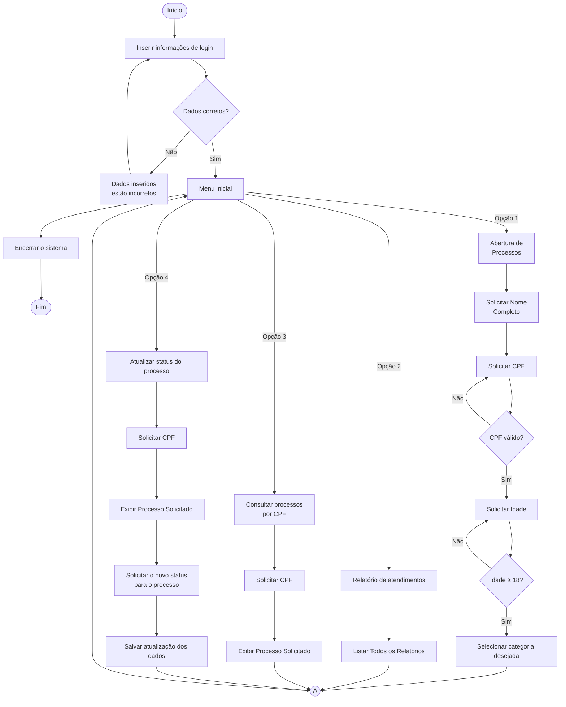

# 🚗 Sistema de Gerenciamento para Clínica Habilitar 🚦

<div align="center">
  
  <br>
  
  
  
  
</div>

## 📚 Informações do Projeto

**SENAC DF – Centro de Educação Profissional Jó Rufino e Carlos Aguiar – Taguatinga**  
**Curso:** Técnico em Desenvolvimento de Sistemas  
**Turma:** 2025.08.53  
**Unidade Curricular:** UC 4 – Analisar Programação Estruturada e Orientada a Objetos  
**Professor Orientador:** Hudson Neves  

**Aluno(a):** [Seu nome completo]  
**Data:** [Data de entrega ou elaboração do trabalho]  

## 👥 Equipe de Desenvolvimento

* [**Erik Eike Silva**](https://github.com/ErikEikeSilva)
* [**Massacral**](https://github.com/Massacral)
* [**Luciana-Anascimento**](https://github.com/Luciana-Anascimento)
* [**Julio5630**](https://github.com/Julio5630)

## ✨ Visão Geral

Um sistema completo para gestão de processos de habilitação veicular, desenvolvido em C com foco em:

- 👥 Controle de clientes
- 📝 Gerenciamento de processos
- 📊 Geração de relatórios
- 🔒 Acesso seguro

## 🛠️ Funcionalidades Principais

| Módulo          | Descrição                                                                 | Status       |
|-----------------|---------------------------------------------------------------------------|-------------|
| 📋 Cadastro     | Registro completo de clientes com validação de dados                      | ✅ Completo  |
| 🔍 Consulta     | Busca ágil por CPF com exibição detalhada                                 | ✅ Completo  |
| 📈 Relatórios   | Listagem organizada de todos os processos                                 | ✅ Completo  |
| 🔄 Atualização  | Modificação de status dos processos                                       | ✅ Completo  |
| 💾 Persistência | Armazenamento em arquivo para manutenção dos dados                        | ✅ Completo  |

## 🖥️ Pré-visualização da Interface

<div align="center">
  
</div>

## ⚙️ Tecnologias Utilizadas



## 📦 Requisitos e Instalação

### Pré-requisitos
- GCC (compilador C)
- Terminal Linux/Windows

### Passo a passo
```bash
# Clone o repositório
git clone https://github.com/usuario/clinica-habilitar.git

# Acesse o diretório
cd clinica-habilitar

# Compile o programa
gcc sistema_habilitar.c -o sistema_habilitar.exe

# Execute
./sistema_habilitar.exe
```

## 🔐 Credenciais de Acesso
```plaintext
Usuário: admin
Senha: 1234 
```

## 📚 Documentação Técnica

### Estrutura do Projeto
```
clinica-habilitar/
├── sistema_habilitar.c  # Código fonte principal
├── clientes_cnh.txt     # Banco de dados de clientes
└── README.md            # Documentação
```

### Validações Implementadas
- ✔️ CPF (formato e dígitos)
- ✔️ Idade mínima (18 anos)
- ✔️ Categorias de CNH válidas
- ✔️ Tipos de serviço permitidos

## 🚦 Próximas Implementações
- [ ] Módulo financeiro
- [ ] Interface gráfica
- [ ] Backup automático
